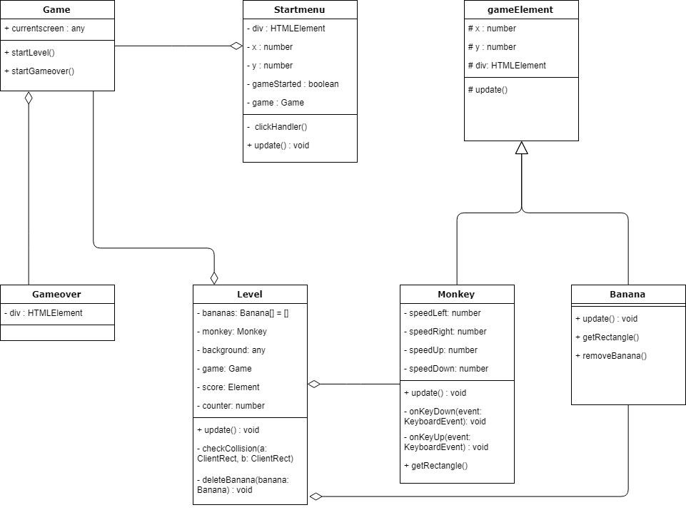

# Programmeren

    Voor deze periode moesten we een game maken voor programmeren in Typescript.
     Ik heb een game gemaakt waar een aapje de hoofdrol speelt. Hij moet bananen verzamelen en zo krijgt hij punten. 
     Hij moet wel oppassen voor de vuurballen die uit de lucht komen!!

    Voor de game waren er 3 eisen:

    * Encapsulation
    * Inheritance
    * idk

   ### Encapsulation

    De betekenis van encapsulation is dat elk object van een game afgeschermd is van elkaar. Ze kunnen elkaar niet
    'zien'. De game weet dat er een aap, banaan en vuurbal is. Maar de aap weet niet dat er een banaan is en ook 
    niet dat er een vuurbal is. Echter kan er via encapsulation informatie worden uitgewisseld. Dit werkt alsof 
    ze met een luikje toch bij elkaar kunnen komen.

     Er zijn twee vormen van encapsulation die we geleerd hebben:

     1. Het krijgen van leesrechten dat ziet er zo uit:

        ```typescript
        public getX() : number {
		Return this.x
        } 
        ```
     2. Het krijgen van schrijfrechten:

     ```typescript
        Public setX(x:number) : void {
        This.x=x
        } 

     ```
     Ik heb encapsulation in mijn game gedaan door mijn variabele privated te maken. Zoals te zien is in mijn klassendiagram heb ik in mijn parentclass de variabelen protected gemaakt. Hierdoor kunnen ze alleen via de childclasses worden benaderd.  De childclasses zijn Monkey en Banana.
     Sommige functies zoals update moeten benaderd kunnen worden vanuit meerdere classen die heb ik public gemaakt.
     Het is beter om zoveel mogelijk op private te houden. 

 ### Inheritance

     Bij inheritance maak je gebruik van een bestand die boven de andere classes staan. Het is een
     blauwdruk van de blauwdrukken. Het is een abstractielevel erboven als een soort parentclass. 
     Bepaalde elementen kunnen bij meerdere classen voorkomen, zoals x en y en het aanmaken van 
     het object. Om een variabele aan te spreken in de gameObject of gameelement class gebruik je 
     bij de childclasses super. Met super kan je variabele doorsturen naar de parent class. Deze 
     variabele stuur je meevia de constructor in de game.

     Wanneer er een functie is die dezelfde naam heeft in de child- en parentclass wordt de functie
     in de parentclass eerder uitgevoerd dan in de childclass.

     In mijn spel heb ik voor de parentclass een GameElement.ts bestand aangemaakt. Hier wordt de x 
     en y positie bepaald van de bananen en fireballs. Ook wordt elk gameobject gedrawt via de
     parentclass. Ik geef in de game.ts een x en y mee naar de classes toe. Bij de classes wordt er
     een type doorgegeven via super naar de parentclass.
     Je geeft inheritance aan met is a:

*   Banana is a gameElement.
*   Monkey is a gameElement.

### Composition

    Composition is de relatie die verschillende classen met elkaar hebben. Zo heeft in mijn game de class game een class startmenu, gameover en level. Class level heeft dus een class monkey en een class banana. Je geeft de relaties aan met has a:

*   Game has a startmenu. 
*   Game has a level.
    * Level has a Banana.
    * Level has a Monkey.
*   Game has a gameover.

### Klassendiagram

    Ik heb een klassendiagram gemaakt van mijn game:



### Extra uitdaging

    Je kon kiezen uit verschillende uitdagingen. De uitdaging die ik gekozen heb is: 

        "De game gebruikt een externe library uit de lijst in deze modulewijzer."
    
    Ik heb gekozen voor howler.js. Ik heb online een muziekje gevonden die ik heel het spel laat horen. De code voor de library is te vinden in howler.js.

   ## Review

     Ik heb de game van Civan gereviewt. De link naar zijn game is:

     https://github.com/iCivan/gamepr04/tree/iCivan-dev

    De game die hij heeft gemaakt was leuk, maar wel moeilijk. Ik denk dat het concept waar hij 
    voor wilt gaan is dat je de stad moet beschermen tegen bommen. Deze bommen komen vanuit de
    linker hoek naar beneden. Via een klikevent worden ze verwijderd. Het is best moeilijk om 
    een klik uit te voeren op het object aangezien het pas een klik is als de klik wordt los gelaten
    op hetzelfde object. Het is me 1 keer gelukt om één bom te verwijderen.

    Ik heb gekeken naar de drie dingen die hij in zijn code moet hebben voor de oplevering.
    1. Inheritance: Hij heeft nog geen inheritance. Ik zou dit erin doen als je nog meer objecten
    gaat toevoegen. Je kan dan de x en de y in je GameElement file doen.

    2. Composition: In zijn spel heeft de game bommen. De bommen weten niets van de game.
    3. Encapsulation: Hij heeft ook nog geen encapsulation. Al zijn variabelen zijn namelijk op default.
    De default in Typescript is public. Hierdoor kan je vanuit elke class bij alle functies en variabelen
    wat niet de bedoeling is.

    Conclusie van de feedback:
    Ik zou nog kijken of je de drie dingen toe kan voegen. Je concept is wel leuk, maar misschien
    nog meer onderdelen in je game. Dan is het ook makkelijker om die drie eisen er in te verwerken. 
    Ook zou ik zoveel mogelijk dingen private houden 
    zodat je niet vanuit elke class bij kan.
